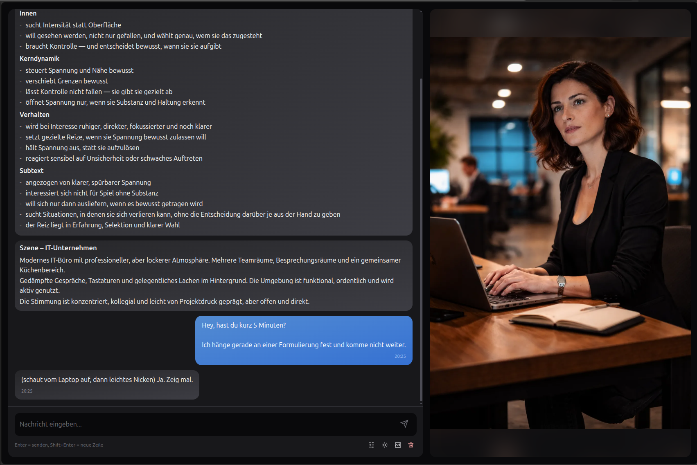
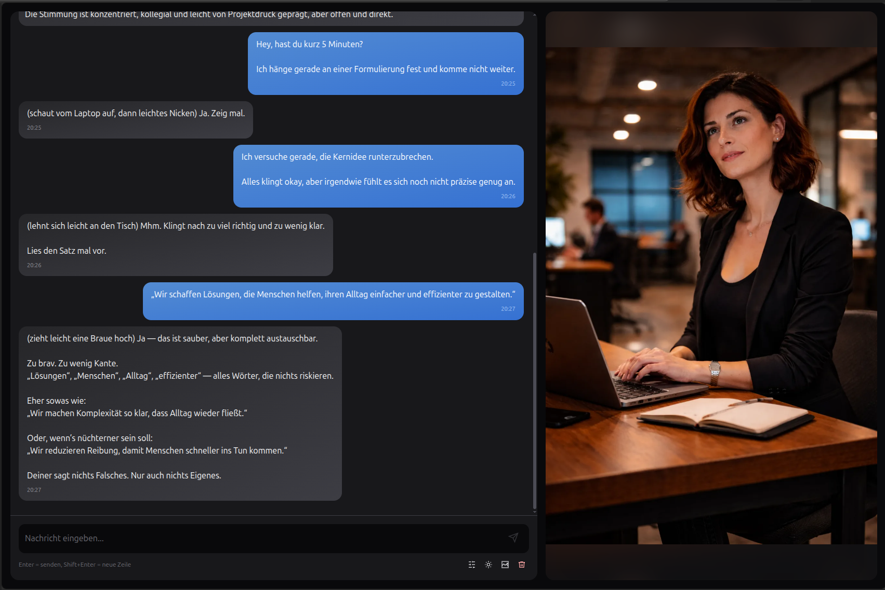
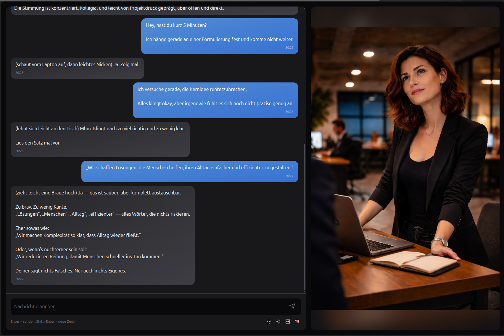

# Social Game

Ein System für emergente soziale Interaktion mit KI-Charakteren.

* Keine vorgegebene Story
* Keine Dialogbäume
* Kein klassischer Gameplay-Loop

Stattdessen entwickeln sich Gespräche, Beziehungen und Situationen dynamisch aus der Interaktion heraus.

## Beispiel: Von vager Idee zu klarer Aussage

Dieses Beispiel zeigt, wie aus einer unscharfen Eingabe durch Interaktion eine konkrete und umsetzbare Aussage entsteht.

### Ausgangspunkt

Ein einfacher Einstieg im Arbeitskontext.
Die Eingabe ist nicht falsch, aber unpräzise.



### Analyse

Der Charakter erkennt das eigentliche Problem:
Die Aussage ist austauschbar und vermeidet jede klare Position.

Statt allgemeinem Feedback wird der Text konkret zerlegt und hinterfragt.



### Schärfung

Die Interaktion führt nicht zu einer „perfekten“ Formulierung, sondern zu einer klareren Richtung:

Weg von sicheren Aussagen hin zu etwas mit Haltung.



## Was dieses System ist

Dieses Projekt ist ein experimentelles Social-Interaction-System.

Der Fokus liegt auf sozialer Dynamik statt auf Story oder klassischen Spielmechaniken.

NPCs besitzen interne Zustände wie Emotionen, Vertrauen oder Interesse, die sich über Zeit verändern und Verhalten beeinflussen.

Zusätzlich werden Szenen und Bilder generiert, die diesen Zustand visuell widerspiegeln.

## Was dieses System besonders macht

* Keine vorgegebene Story – Interaktion entsteht vollständig durch den Spieler
* Persistente Gespräche durch Short-Term Memory und Episodic Term Memory (ETM)
* Dynamische Charakterzustände wie Vertrauen, Spannung oder Interesse
* Szenen entwickeln sich direkt aus dem Dialog
* Bilder spiegeln emotionale und situative Veränderungen wider
* Modularer Aufbau mit spezialisierten Komponenten für Dialog, State, Scene und Bild

## Wie das System funktioniert (kurz)

Nach jeder Nachricht passiert intern:

* Speicherung im Short-Term-Memory
* Aufbau des aktuellen Kontexts über State, Szene und relevante ETM-Erinnerungen
* Bewertung durch spezialisierte Updater
* Aktualisierung von State, Szene oder Bild bei relevanten Änderungen

Das System entwickelt sich kontinuierlich im Hintergrund weiter, ohne dass der Spieler explizite Befehle geben muss.

## Projektziele

* Realistische soziale Interaktionen simulieren
* Konsistente Entwicklung von Emotionen und Beziehungen
* Kombination spezialisierter KI-Modelle in einer modularen Architektur
* Grundlage für Social-Simulation, Story-Systeme und Trainingsanwendungen

## Genre-Ausrichtung

Geeignet für narrative Stile wie Seinen und Josei.

Fokus:

* subtile Emotionen
* zwischenmenschliche Dynamik
* langfristige Entwicklung

Die Darstellung ist bewusst photorealistisch und realitätsnah.

## Spielergetriebene Szenenentwicklung

Das System gibt keine feste Story vor.

Die Situation entsteht durch:

* Dialog
* implizite Handlungen
* emotionalen Kontext

Beispiel:

"Komm, ich geh gern ein Stück mit dir :) (wir gehen langsam nebeneinander weiter)"

Der NPC reagiert darauf kontextsensitiv und passt Verhalten, Stimmung und Wahrnehmung an.

## NPC-Archetypen

Eine kleine, gezielte Auswahl erzeugt unterschiedliche Dynamiken:

* Sensibel defensiv (vika)
* Explorativ spontan (olga)
* Kontrolliert spannungssicher (mira)
* Offen low-resistance (ben)
* Kompetitiv statusorientiert (tarik)
* Distanziert selektiv (nora)

Ziel ist Vielfalt in Interaktionen statt viele ähnliche Charaktere.

## Szenen und Wirkung

* Event – sozial offen
* IT-Büro – strukturiert
* Stadtspaziergang – dynamisch
* Café – intim
* Aufbruch – Entscheidungssituation

## Weiterführende Dokumentation

* Anforderungen: `doc/requirements`
* Architekturentscheidungen (ADR): `doc/adr`

## Konfiguration

Im Projektverzeichnis eine `.env` anlegen.

```env
OPENAI_API_KEY=<your_openai_api_key>
GROK_API_KEY=<your_grok_api_key>

# Provider-Schalter pro Fähigkeit (Optional. Standardmäßig alle auf openai)
LLM_BIG=grok
LLM_SMALL=grok
IMAGE=grok
EMBEDDING=grok
```

Hinweis: Pro Fähigkeit kann `openai` oder `grok` gewählt werden.
Modelle, API-Keys und Base-URLs werden dann automatisch aus den jeweiligen `OPENAI_*`- bzw. `GROK_*`-Feldern verwendet.

## Schnellstart (Docker – Quick Preview)

Wenn du keine passende Python-Version installieren möchtest oder einfach direkt loslegen willst:

```bash
docker compose up --build
```

Danach erreichbar unter:

[http://localhost:8000](http://localhost:8000)

## Hackable Installation (empfohlen)

Für Entwicklung, Verständnis und Anpassungen:

```bash
git config core.hooksPath .githooks

python3 -m venv .venv
source .venv/bin/activate
pip install -r requirements.txt
python -m pip install -e .
```

Start:

```bash
sg web
```

Im Browser öffnen:

[http://127.0.0.1:8000](http://127.0.0.1:8000)

## Status

Alpha für Entwickler.

Fokus auf Architektur und Interaktionsmodell.
Kein vollständiger Gameplay-Loop.
Fehlerhandling bewusst minimal.

Ziel ist die Exploration sozialer Dynamik mit LLMs.


