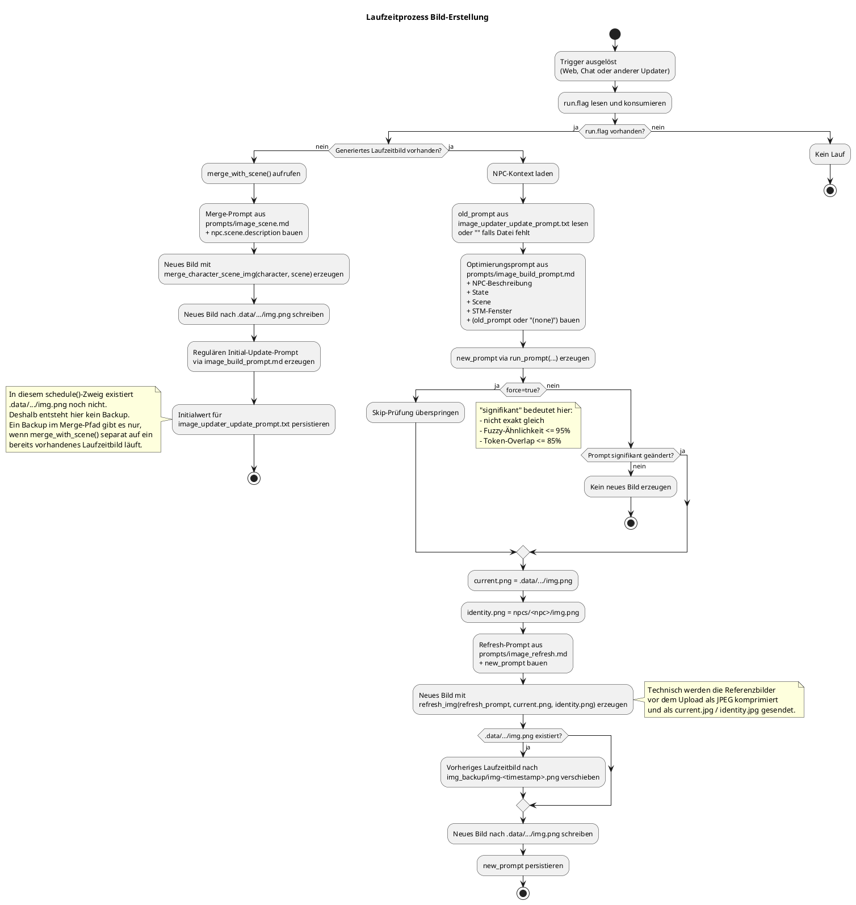

# Laufzeitprozess Bild-Erstellung

## Zweck

Dieses Dokument beschreibt den Laufzeitprozess zur Erstellung und Aktualisierung von NPC-Bildern im aktiven NPC-Szenen-Kontext.
Der Fokus liegt auf dem tatsächlich implementierten Ablauf in der Runtime.

## Beteiligte Komponenten

- `engine/web/app.py`: manueller Trigger über `POST /api/image/refresh-active`
- `engine/updater/state_updater.py`: stößt Bild-Update nach State-Änderung an
- `engine/updater/scene_updater.py`: stößt Bild-Update nach Szenen-Änderung an
- `engine/updater/image_updater.py`: orchestriert Prompt-Erzeugung, Bildgenerierung, Backup und Persistierung
- `engine/stores/npc_store.py`: lädt aktiven NPC-, Szenen- und Bildkontext
- `engine/llm_client.py`: ruft LLM für Prompt-Optimierung und Bildmodell für das neue Bild auf

## Überblick

Die Bild-Erstellung folgt zur Laufzeit einem entscheidungsorientierten Ablauf:

1. Trigger prüfen und Run-Flag konsumieren
2. Kontext und Bildquellen auflösen
3. Prompt erzeugen und gegen den letzten Prompt bewerten
4. Nur bei relevanter Änderung ein neues Bild rendern und persistieren

Der Prozess kann manuell über die Web-API gestartet oder indirekt von anderen Updatern ausgelöst werden.
Dabei wird immer im aktiven Kontext aus `npc_id` und `scene_id` gearbeitet.

## Auslöser

Es gibt aktuell drei relevante Startpunkte:

- Web-GUI: `POST /api/image/refresh-active`
- `StateUpdater`: nach erfolgreicher Aktualisierung von `state.md`
- `SceneUpdater`: nach erfolgreicher Aktualisierung von `scene.md`

Zusätzlich ruft der Chat-Flow nach der ersten persistierten Nachricht `ImageUpdater.emit_update_if_missing()` auf. Wenn für den aktiven NPC-Szenen-Kontext noch kein generiertes Laufzeitbild unter `.data/npcs/<npc_id>/<scene_id>/img.png` existiert, wird dadurch nur das Run-Flag gesetzt. Die eigentliche Ausführung bleibt beim Background-Scheduler.

`StateUpdater` und `SceneUpdater` erzeugen nicht direkt ein Bild, sondern setzen nur ein Run-Flag über `ImageUpdater.emit_update()`.
Die eigentliche Ausführung erfolgt dann in `ImageUpdater.schedule()`.

## Laufzeitablauf im Detail

### 1. Trigger und Run-Flag

`ImageUpdater.emit_update()` schreibt die Datei:

- `.data/npcs/<npc_id>/<scene_id>/orchestrator/image_updater_run.flag`

`ImageUpdater.schedule()` startet nur dann den Bildlauf, wenn dieses Flag vorhanden ist.
Beim Start wird das Flag sofort konsumiert und gelöscht.

Der manuelle Web-Trigger ruft direkt hintereinander auf:

1. `emit_update()`
2. `schedule(force=True)`

Dadurch wird die Bildgenerierung sofort ausgeführt und die Skip-Logik für ähnliche Prompts deaktiviert.

### 2. Kontext laden und Bildquellen auflösen

`ImageUpdater.schedule()` lädt im regulären Refresh-Pfad den aktiven NPC-Kontext über `NpcStore.load()` und löst dabei zwei Bildpfade auf:

- NPC-Beschreibung
- aktueller State
- zusammengeführte Szenenbeschreibung
- Short-Term-Memory, das für den Prompt später als formatiertes Fenster der letzten Nachrichten verwendet wird
- Basisbild des NPC als `npc.img`
- aktuell verwendetes Bild des NPC-Szenen-Kontexts als `npc.img_current`

Für `npc.img_current` gilt diese Priorität:

1. Laufzeitbild `.data/npcs/<npc_id>/<scene_id>/img.png`
2. szenenspezifisches Bild `npcs/<npc_id>/scenes/<scene_id>/img.png`
3. Standardbild `npcs/<npc_id>/img.png`

`npc.img` ist immer das Standardbild `npcs/<npc_id>/img.png`.
Dadurch gibt es auch dann verwertbare Bildinputs, wenn noch kein Laufzeitbild existiert.

Wenn noch kein generiertes Laufzeitbild unter `.data/npcs/<npc_id>/<scene_id>/img.png` existiert, verzweigt `ImageUpdater.schedule()` sofort in denselben Initial-Merge-Pfad wie `merge_with_scene()` und überspringt den regulären Refresh-Pfad vollständig.
Im `schedule()`-Initialfall ist damit per Definition noch kein Laufzeitbild vorhanden; ein Backup-Schritt auf Basis von `.data/npcs/<npc_id>/<scene_id>/img.png` tritt dort also nicht ein.

### 3. Initialfall: direkter Übergang in den Merge-Pfad

Wenn noch kein generiertes Laufzeitbild existiert, ruft `ImageUpdater.schedule()` direkt `merge_with_scene()` auf.
Damit wird für den ersten Bildlauf nicht der reguläre Refresh-Pfad verwendet, sondern der Initial-Merge mit:

- `prompts/image_scene.md`
- `npc.img_current` als Charakterbild
- `npc.scene.img` als Szenenbild
- `npc.scene.description` als zusammengeführte Szenenbeschreibung

Nach erfolgreichem Merge speichert dieser Pfad zusätzlich einen Initialwert für den späteren regulären Update-Prompt unter `.data/npcs/<npc_id>/<scene_id>/orchestrator/image_updater_update_prompt.txt`.
Ein Backup entsteht in diesem `schedule()`-Initialfall nicht, weil dabei per Definition noch kein generiertes Laufzeitbild unter `.data/npcs/<npc_id>/<scene_id>/img.png` existiert.

### 4. Rohprompt aufbauen

Der Rohprompt wird aus `prompts/image_build_prompt.md` erzeugt.
Darin werden diese Daten eingesetzt:

- `{{NPC_DESCRIPTION}}`
- `{{CURRENT_IMAGE_PROMPT}}` mit dem zuletzt gespeicherten Prompt oder dem Platzhalter `(none)`
- `{{CURRENT_STATE}}`
- `{{CURRENT_SCENE}}`
- `{{CURRENT_STM}}` als formatiertes STM-Fenster der letzten Nachrichten

Das Ergebnis ist noch kein finaler Bildprompt, sondern ein strukturierter Eingabetext für die Prompt-Optimierung.

### 5. Prompt optimieren und Entscheidung treffen

Der Rohprompt wird mit `run_prompt(..., model=config.MODEL_LLM_SMALL)` verarbeitet.
Das Ergebnis ist ein kompakter Bildprompt für die eigentliche Bildbearbeitung.

Anschließend prüft `ImageUpdater`, ob sich der neue Prompt gegenüber dem zuletzt gespeicherten Prompt relevant geändert hat.
Dabei gibt es drei Skip-Kriterien:

- exakte Gleichheit
- sehr hohe Fuzzy-Ähnlichkeit
- sehr hoher Token-Overlap

Wenn kein signifikanter visueller Unterschied erkannt wird und `force=False` ist, endet der Ablauf ohne neue Bilddatei.
Wenn noch kein alter Prompt vorliegt oder die Unterschiede groß genug sind, läuft die Bildgenerierung weiter.

### 6. Bild generieren

Für die Bildgenerierung wird aus `prompts/image_refresh.md` ein Refresh-Prompt gebaut.
Danach ruft `ImageUpdater` `refresh_img(...)` auf.

An das Bildmodell werden zwei Referenzen übergeben:

- `current.png`: `npc.img_current` für Outfit, Pose, Framing und visuelle Kontinuität
- `identity.png`: `npc.img` als stabiles Referenzbild für Identität, Gesicht, Haare und Körperproportionen

Das Bildmodell erzeugt daraus ein neues PNG.
Konzeptionell arbeiten Prompt und Ablauf mit `current.png` und `identity.png`; technisch werden die Referenzen vor dem Upload zu komprimierten JPEG-Dateien transformiert.

Praktisch ergeben sich damit zwei relevante Fälle:

- **Noch kein Laufzeitbild vorhanden:** `current.png` kommt aus dem szenenspezifischen NPC-Bild oder aus dem Standardbild; `identity.png` ist das Standardbild.
- **Bereits Bild vorhanden:** `current.png` ist das bestehende Laufzeitbild; `identity.png` bleibt das Standardbild.

### 7. Backup und Persistierung

Bevor das neue Bild gespeichert wird, verschiebt `ImageUpdater` ein vorhandenes Laufzeitbild nach:

- `.data/npcs/<npc_id>/<scene_id>/img_backup/img-<timestamp>.png`

Danach werden gespeichert:

- neues Laufzeitbild unter `.data/npcs/<npc_id>/<scene_id>/img.png`
- neuer Bildprompt unter `.data/npcs/<npc_id>/<scene_id>/orchestrator/image_updater_update_prompt.txt`

Damit steht sowohl das neue aktive Bild als auch der letzte gültige Prompt für spätere Vergleiche zur Verfügung.

## Sonderfälle

### Manuelles Refresh

`POST /api/image/refresh-active` ruft `schedule(force=True)` auf.
Dadurch wird ein neues Bild auch dann erzeugt, wenn der neue Prompt dem alten sehr ähnlich ist.

### Merge mit Szenenbild

`CharacterImageService.merge_with_scene()` ist ein separater Pfad.
Hier werden Charakterbild und Szenenbild zusammen mit `prompts/image_scene.md` an das Bildmodell gegeben.
Fachlich setzt dieser Pfad den aktiven NPC mit stabiler Identität in den aktuellen Szenenkontext ein und übernimmt Umgebung, Komposition sowie explizite Szenenvorgaben aus der zusammengeführten Szenenbeschreibung.
Damit erfüllt er insbesondere den Einbezug des aktiven NPC als Charaktergrundlage und den Einbezug der zusammengeführten Szenenbeschreibung aus `doc/requirements/sg-014-initiale-bildgenerierung-aus-npc-und-szenenkontext.md`.
Dieser Ablauf ist der Initial-Merge-Prozess. Derselbe Pfad wird auch von `schedule()` verwendet, solange für den aktiven NPC-Szenen-Kontext noch kein generiertes Laufzeitbild existiert. Wird `merge_with_scene()` separat auf ein bereits vorhandenes Laufzeitbild ausgeführt, sichert `_write_image(...)` das alte Bild vorher nach `img_backup/`.

## Artefakte

Wichtige Laufzeitdateien pro NPC-Szenen-Kontext:

- `.data/npcs/<npc_id>/<scene_id>/img.png`
- `.data/npcs/<npc_id>/<scene_id>/img_backup/img-<timestamp>.png`
- `.data/npcs/<npc_id>/<scene_id>/orchestrator/image_updater_run.flag`
- `.data/npcs/<npc_id>/<scene_id>/orchestrator/image_updater_update_prompt.txt`

## Aktivitätsdiagramm

Der Prozess ist an mehreren Stellen bewusst entscheidungsorientiert: Zuerst wird geprüft, ob für den aktiven NPC-Szenen-Kontext überhaupt ein Bildlauf ansteht. Danach wird aufgelöst, welches Bild als aktueller visueller Zustand weitergeführt wird. Anschließend wird entschieden, ob der neu erzeugte Prompt gegenüber dem letzten Stand eine relevante visuelle Änderung enthält. Nur wenn diese Prüfungen den Lauf rechtfertigen, wird ein neues Bild erzeugt und als aktives Laufzeitbild persistiert.

