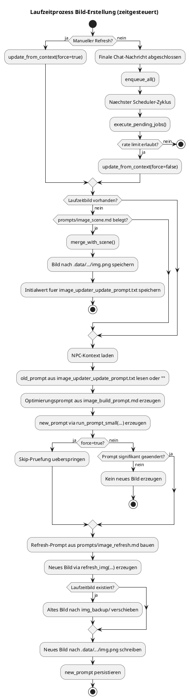

# Laufzeitprozess Bild-Erstellung

## Zweck

Dieses Dokument beschreibt den Laufzeitprozess zur Erstellung und Aktualisierung von NPC-Bildern im aktiven NPC-Szenen-Kontext.
Der Fokus liegt auf dem aktuell implementierten zeitgesteuerten Ablauf über den Scheduler mit Job-basierten Updates.

## Beteiligte Komponenten

- `engine/web/app.py`: manueller Trigger über `POST /api/image/refresh-active` und Lifespan-Start des Schedulers
- `engine/tools/scheduler.py`: stößt periodisch `execute_pending_jobs()` an
- `engine/tools/image_job.py`: startet Bild-Updates über den `ImageService`
- `engine/services/character_image_service.py`: orchestriert Prompt-Erzeugung, Bildgenerierung, Backup und Persistierung
- `engine/stores/npc_store.py`: lädt aktiven NPC-, Szenen- und Bildkontext
- `engine/llm/client.py`: ruft LLM für Prompt-Optimierung und Bildmodell für das neue Bild auf

## Überblick

Die Bild-Erstellung folgt zur Laufzeit einem entscheidungsorientierten Ablauf:

1. Auslöser erfassen (finale Chat-Nachricht oder manueller API-Refresh)
2. Kontext und Bildquellen auflösen
3. Prompt erzeugen und gegen den letzten Prompt bewerten
4. Nur bei relevanter Änderung ein neues Bild rendern und persistieren

Im automatischen Pfad wird immer im aktiven Kontext aus `npc_id` und `scene_id` gearbeitet.

## Auslöser

Es gibt zwei relevante Startpfade:

- **Chat-getriggerter Pfad (automatisch):** nach einer final erfolgreich gestreamten Chat-Nachricht ruft der Web-Flow `enqueue_all()` auf; `image` wird anschließend im nächsten Scheduler-Zyklus über `execute_pending_jobs()` rate-limitiert ausgeführt.
- **Manueller Pfad:** `POST /api/image/refresh-active` ruft direkt `ImageService.update_from_context(force=True)` auf.

LLM-Tool-/Function-Calling wird bewusst nicht genutzt. Hintergrund: In diesem Modus liefert das Modell typischerweise keine normale Antwort. Ein Twice-Call-Pattern würde für dieselbe Wirkung unnötige Kosten und zusätzliche Komplexität erzeugen.

## Laufzeitablauf im Detail

### 1. Job-Aktivierung und Scheduler-Ausführung

Im automatischen Pfad aktiviert der Web-Flow `image` zusammen mit den anderen Jobs über `enqueue_all()` als pending Job im `Scheduler`.
Die Ausführung erfolgt anschließend durch den Scheduler über `execute_pending_jobs()` unter Berücksichtigung von `ImageJob.rate_limit_seconds`.

### 2. Kontext laden und Bildquellen auflösen

`ImageService.update_from_context()` lädt den aktiven NPC-Kontext über `NpcStore.load()` und nutzt:

- NPC-Beschreibung
- aktueller State
- zusammengeführte Szenenbeschreibung
- Short-Term-Memory als Fenster der letzten Nachrichten
- Basisbild des NPC als `npc.img`
- aktuell verwendetes Bild des NPC-Szenen-Kontexts als `npc.img_current`

Für `npc.img_current` gilt diese Priorität:

1. Laufzeitbild `.data/npcs/<npc_id>/<scene_id>/img.png`
2. szenenspezifisches Bild `npcs/<npc_id>/scenes/<scene_id>/img.png`
3. Standardbild `npcs/<npc_id>/img.png`

### 3. Initialfall: direkter Übergang in den Merge-Pfad

Wenn noch kein generiertes Laufzeitbild unter `.data/npcs/<npc_id>/<scene_id>/img.png` existiert und `prompts/image_scene.md` belegt ist, verzweigt `update_from_context()` direkt in `merge_with_scene()`.

Dieser Pfad nutzt:

- `prompts/image_scene.md`
- `npc.img_current` als Charakterbild
- `npc.scene.img` als Szenenbild
- `npc.scene.description` als zusammengeführte Szenenbeschreibung

Nach erfolgreichem Merge wird zusätzlich ein Initialwert für den späteren Refresh-Prompt unter `.data/npcs/<npc_id>/<scene_id>/scheduler/image_updater_update_prompt.txt` gespeichert.

### 4. Rohprompt aufbauen

Der Rohprompt wird aus `prompts/image_build_prompt.md` erzeugt.
Darin werden diese Daten eingesetzt:

- `{{NPC_DESCRIPTION}}`
- `{{CURRENT_IMAGE_PROMPT}}` mit dem zuletzt gespeicherten Prompt oder `(none)`
- `{{CURRENT_STATE}}`
- `{{CURRENT_SCENE}}`
- `{{CURRENT_STM}}` als formatiertes STM-Fenster der letzten Nachrichten

### 5. Prompt optimieren und Entscheidung treffen

Der Rohprompt wird mit `run_prompt_small(...)` zu einem kompakten Bildprompt optimiert.

Anschließend prüft `ImageService`, ob sich der neue Prompt gegenüber dem letzten Prompt relevant geändert hat.
Skip-Kriterien (wenn `force=False`):

- exakte Gleichheit
- sehr hohe Fuzzy-Ähnlichkeit
- sehr hoher Token-Overlap

Wenn kein signifikanter visueller Unterschied erkannt wird, endet der Ablauf ohne neue Bilddatei.

### 6. Bild generieren

Für die Bildgenerierung wird aus `prompts/image_refresh.md` ein Refresh-Prompt gebaut.
Danach ruft der Service `refresh_img(...)` auf.

An das Bildmodell werden zwei Referenzen übergeben:

- `current.png`: `npc.img_current` für Outfit, Pose, Framing und visuelle Kontinuität
- `identity.png`: `npc.img` als stabiles Referenzbild für Identität, Gesicht, Haare und Körperproportionen

Konzeptionell arbeiten Prompt und Ablauf mit `current.png` und `identity.png`; technisch werden die Referenzen vor dem Upload zu komprimierten JPEG-Dateien transformiert.

### 7. Backup und Persistierung

Bevor das neue Bild gespeichert wird, verschiebt der Service ein vorhandenes Laufzeitbild nach:

- `.data/npcs/<npc_id>/<scene_id>/img_backup/img-<timestamp>.png`

Danach werden gespeichert:

- neues Laufzeitbild unter `.data/npcs/<npc_id>/<scene_id>/img.png`
- neuer Bildprompt unter `.data/npcs/<npc_id>/<scene_id>/orchestrator/image_updater_update_prompt.txt`

## Sonderfälle

### Manuelles Refresh

`POST /api/image/refresh-active` ruft `update_from_context(force=True)` auf.
Dadurch wird die Prompt-Skip-Logik deaktiviert.

### Merge mit Szenenbild

`ImageService.merge_with_scene()` ist auch separat nutzbar (CLI/Service-Pfad).
Wird der Merge auf ein bereits vorhandenes Laufzeitbild ausgeführt, sichert `_write_image(...)` das alte Bild vorher nach `img_backup/`.

## Artefakte

Wichtige Laufzeitdateien pro NPC-Szenen-Kontext:

- `.data/npcs/<npc_id>/<scene_id>/img.png`
- `.data/npcs/<npc_id>/<scene_id>/img_backup/img-<timestamp>.png`
- `.data/npcs/<npc_id>/<scene_id>/scheduler/image_updater_update_prompt.txt`

## Aktivitätsdiagramm

